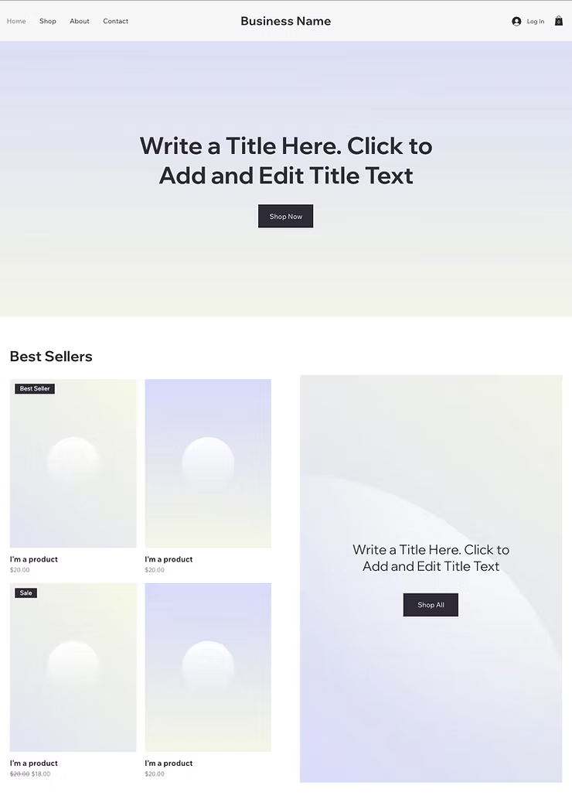

# Laboratorium 2: Graficzny interfejs użytkownika

**Student:** Maksym (121261)
**Przedmiot:** Komunikacja Człowiek-Komputer
**Prowadzący:** Wojciech Miksa

---

## Cel ćwiczenia

Wykonanie 3 szkiców graficznego interfejsu użytkownika zgodnie z heurystykami Nielsena i zasadami projektowania GUI.

---

## Opis projektu

Projekt przedstawia trzy różne podejścia do interfejsu aplikacji biznesowej/e-commerce, demonstrując różne aspekty interakcji użytkownika z systemem.

---

## Szkic 1: Landing Page / Strona Główna

**Plik:** `1.png`

### Opis
Główna strona powitalna z hero section, zaprojektowana zgodnie z zasadą minimalizmu i przejrzystości.

### Elementy interfejsu (9 kontrolek):
1. **Nawigacja górna:**
   - Link "Home"
   - Link "Product"
   - Link "Company"
   - Przycisk "Try Us Now" (CTA)

2. **Hero section:**
   - Nagłówek edytowalny "Write a Title Here"
   - Blok tekstowy z opisem
   - Przycisk "Explore" (główna akcja)

3. **Social media:**
   - Ikona X (Twitter)
   - Ikona Facebook
   - Ikona Instagram

4. **Obszar wizualny:** Placeholder na grafikę/zdjęcie

### Zastosowane zasady GUI:
- ✅ **Spójność i standardy:** Standardowe umiejscowienie nawigacji u góry
- ✅ **Estetyczny i oszczędny wygląd:** Minimalistyczny design, dużo białej przestrzeni
- ✅ **Widoczność statusu systemu:** Wyraźne oznaczenie aktywnej sekcji
- ✅ **Rozpoznawanie zamiast przypominania:** Ikony social media są powszechnie rozpoznawalne

---

## Szkic 2: Strona Mobilna / Cennik

**Plik:** `2.png`

### Opis
Responsywny interfejs mobilny z sekcją pricing/statystyk, demonstrujący adaptive design.

### Elementy interfejsu (10+ kontrolek):
1. **Header:**
   - Logo "WIX STUDIO"
   - Ikony podglądu (desktop/tablet/mobile) - 3 kontrolki
   - Przycisk "Edit Template"
   - Menu hamburger

2. **Content section:**
   - Logo firmy "Business Name"
   - Nagłówek "Add the Title Text Here"
   - Blok tekstowy z opisem
   - Przycisk "Learn More"

3. **Karty cenowe/statystyki:**
   - Karta "20k" z opisem
   - Karta "30k" z opisem
   - Karta "40k" z opisem

### Zastosowane zasady GUI:
- ✅ **Elastyczność i sprawność użycia:** Możliwość przełączania między widokami (desktop/tablet/mobile)
- ✅ **Dopasowanie między programem a rzeczywistością:** Jasne przedstawienie liczb i statystyk
- ✅ **Zapobieganie błędom:** Wyraźne przyciski akcji
- ✅ **Spójność wizualna:** Jednolity styl kart i przycisków

---

## Szkic 3: Strona E-commerce / Katalog Produktów

**Plik:** `3.png`

### Opis
Pełnowymiarowa strona sklepu internetowego z katalogiem produktów i sekcją bestselerów.

### Elementy interfejsu (15+ kontrolek):
1. **Nawigacja główna:**
   - Link "Home"
   - Link "Shop"
   - Link "About"
   - Link "Contact"
   - Logo "Business Name"
   - Przycisk "Log In"
   - Ikona koszyka

2. **Hero section:**
   - Nagłówek główny
   - Przycisk "Shop Now"

3. **Sekcja "Best Sellers":**
   - 4 karty produktów z:
     - Obrazem produktu
     - Nazwą "I'm a product"
     - Ceną ($20.00)
     - Badge'ami ("Best Seller", "Sale")
   - Przycisk "Shop All"

4. **Dodatkowa sekcja promocyjna:**
   - Banner z tekstem
   - Przycisk "Shop All"

### Zastosowane zasady GUI:
- ✅ **Kontrola procesu i swoboda działania:** Łatwa nawigacja i powrót do poprzednich sekcji
- ✅ **Spójność i standardy:** Typowy układ e-commerce (nawigacja góra, produkty w grid)
- ✅ **Rozpoznawanie zamiast przypominania:** Ikony koszyka i użytkownika są intuicyjne
- ✅ **Estetyczny i oszczędny wygląd:** Przejrzysta prezentacja produktów w grid layout
- ✅ **Zapobieganie błędom:** Wyraźne oznaczenie promocji i bestsellerów

---

## Podsumowanie

### Łączna liczba kontrolek: **34+**
- Szkic 1: 9 kontrolek
- Szkic 2: 10 kontrolek
- Szkic 3: 15 kontrolek

### Spełnienie kryteriów:
- ✅ 3 szkice interfejsu
- ✅ Minimum 5 kontrolek na każdym szkicu (wymagane: 15, osiągnięto: 34+)
- ✅ Spójność stylu (minimalistyczny design, jasne CTA)
- ✅ Przejrzystość szkiców
- ✅ Zgodność z konwencjami GUI

---

## Narzędzia użyte:
- Projektowanie: Figma / Wix Studio Templates
- Format: PNG (1.png, 2.png, 3.png)

---

**Data wykonania:** 18.12.2024
