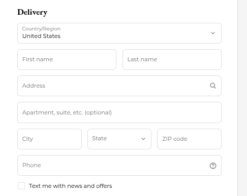
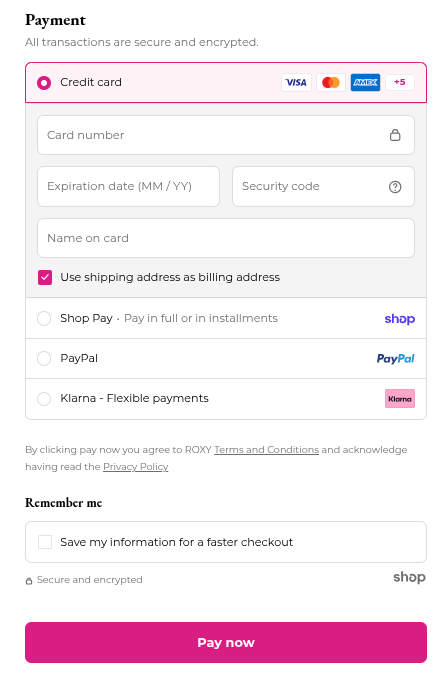

# Zadanie 4: Wrażenia użytkownika (User Experience)

## Projekt procesu zakupu produktu w sklepie internetowym

### Opis zadania
Zaprojektowanie operacji zakupu produktu na stronie internetowej z uwzględnieniem zasad UX i praw psychologii poznawczej omówionych na wykładzie.

---

## Etapy procesu zakupu

### Etap 1: Wybór produktu


**Opis:**
- Strona produktu "Jet Ski Jacket" z możliwością wyboru koloru i rozmiaru
- Galeria zdjęć produktu (4 zdjęcia)
- Wyraźny przycisk "Add to Bag + $229.95"
- Szczegółowy opis produktu i specyfikacja

**Zgodność z prawami UX:**
- **Prawo Millera (7±2)**: Liczba kolorów (5) i rozmiarów (6) mieści się w zalecanym zakresie
- **Prawo Fittsa**: Przycisk "Add to Bag" jest duży, wyraźny i umieszczony w widocznym miejscu
- **Prawo Jakoba**: Standardowe rozplanowanie strony produktu z galерią po lewej i opcjami po prawej
- **Efekt Von Restorffa**: Przycisk dodania do koszyka jest wyróżniony kolorem różowym (magenta)

**Obliczenie czasu wyboru (Prawo Hicka):**

Parametry: a = 5s, b = 1s

1. **Wybór koloru** (n = 5 opcji):
   ```
   T = a + b × log₂(n + 1)
   T = 5 + 1 × log₂(5 + 1)
   T = 5 + log₂(6)
   T = 5 + 2.585
   T ≈ 7.59 sekund
   ```

2. **Wybór rozmiaru** (n = 6 opcji: XS, S, M, L, XL, XXL):
   ```
   T = a + b × log₂(n + 1)
   T = 5 + 1 × log₂(6 + 1)
   T = 5 + log₂(7)
   T = 5 + 2.807
   T ≈ 7.81 sekund
   ```

**Łączny szacowany czas wyboru produktu: ~15.4 sekundy**

---

### Etap 2: Podanie adresu dostawy


**Opis:**
- Formularz z danymi adresowymi
- Wybór kraju/regionu
- Pola: First name, Last name, Address, City, State, ZIP code, Phone
- Opcja subskrypcji newslettera

**Zgodność z prawami UX:**
- **Prawo Millera**: Formularz podzielony logicznie na sekcje, nie więcej niż 7 pól jednocześnie widocznych
- **Prawo Jakoba**: Standardowy układ formularza zgodny z konwencjami (imię i nazwisko obok siebie)
- **Prawo jednakowego połączenia**: Pola First name i Last name są wizualnie zgrupowane
- **Próg Doherthy'ego**: Pole Address ma auto-uzupełnianie (ikona lupy), co przyspiesza wypełnianie
- **Prawo Postela**: Formularz jest liberalny w przyjmowaniu danych (pole Apartment jest opcjonalne)

**Liczba elementów:** 8 pól formularza - zgodnie z prawem Millera (7±2)

---

### Etap 3: Wybór sposobu płatności


**Opis:**
- Formularz płatności kartą kredytową
- Alternatywne metody płatności: Shop Pay, PayPal, Klarna
- Opcja zapisania danych do szybszego checkoutu
- Wyraźny przycisk "Pay now"

**Zgodność z prawami UX:**
- **Prawo Millera**: 4 opcje płatności (Credit card, Shop Pay, PayPal, Klarna) - poniżej limitu 7±2
- **Prawo Jakoba**: 
  - Standardowy układ formularza karty kredytowej
  - Rozpoznawalne ikony metod płatności (Visa, Mastercard, PayPal)
- **Efekt Von Restorffa**: 
  - Credit card jest domyślnie zaznaczony
  - Przycisk "Pay now" wyróżniony intensywnym różowym kolorem
- **Prawo Fittsa**: Przycisk "Pay now" jest duży i zajmuje całą szerokość formularza
- **Prawo jednakowego połączenia**: Pola karty kredytowej są wizualnie zgrupowane razem

**Obliczenie czasu wyboru metody płatności (Prawo Hicka):**

Liczba opcji płatności: n = 4

```
T = a + b × log₂(n + 1)
T = 5 + 1 × log₂(4 + 1)
T = 5 + log₂(5)
T = 5 + 2.322
T ≈ 7.32 sekundy
```

---

### Etap 4: Potwierdzenie i finalizacja zamówienia

**Opis (przewidywany):**
- Podsumowanie zamówienia z produktem, adresem dostawy i metodą płatności
- Wyświetlenie łącznego kosztu
- Przycisk finalizacji "Complete Order"
- Komunikat o pomyślnym złożeniu zamówienia

**Zgodność z prawami UX:**
- **Zasada szczytu i końca**: Pozytywne zakończenie procesu z potwierdzeniem sukcesu
- **Próg Doherthy'ego**: Natychmiastowe potwierdzenie (< 400ms) lub animacja ładowania
- **Prawo Fittsa**: Przycisk finalizacji duży i łatwo dostępny

---

## Podsumowanie zgodności z zasadami UX

### Zastosowane prawa i zasady:

1. **Prawo Jakoba** ✓
   - Standardowe konwencje e-commerce
   - Rozpoznawalne elementy UI (przyciski, formularze)
   - Menu i nawigacja zgodne z oczekiwaniami użytkowników

2. **Prawo Millera (7±2)** ✓
   - Kolory: 5 opcji
   - Rozmiary: 6 opcji
   - Metody płatności: 4 opcje
   - Wszystkie w dopuszczalnym zakresie

3. **Prawo Hicka** ✓
   - Obliczony czas wyboru dla każdego etapu
   - Ograniczona liczba opcji zapobiega paraliżowi decyzyjnemu
   - Hierarchiczne grupowanie (np. pola formularza)

4. **Prawo Fittsa** ✓
   - Duże przyciski akcji ("Add to Bag", "Pay now")
   - Umieszczone w naturalnym obszarze interakcji
   - Łatwo dostępne dla użytkownika

5. **Próg Doherthy'ego (400ms)** ✓
   - Auto-uzupełnianie adresu
   - Natychmiastowa reakcja na wybór opcji
   - (W razie dłuższej operacji: animacje ładowania)

6. **Efekt Von Restorffa** ✓
   - Wyróżnienie głównych przycisków akcji kolorem różowym
   - Domyślnie zaznaczona opcja Credit card

7. **Prawo jednakowego połączenia** ✓
   - Wizualne grupowanie powiązanych elementów
   - Pola First name i Last name obok siebie
   - Pola karty kredytowej w jednym kontenerze

8. **Prawo Postela** ✓
   - Liberalizm w przyjmowaniu danych (opcjonalne pola)
   - Walidacja ale bez nadmiernej restrykcyjności
   - Jasne komunikaty o błędach

9. **Zasada szczytu i końca** ✓
   - Pozytywne momenty: dodanie do koszyka, potwierdzenie zamówienia
   - Minimalizacja frustracji na każdym etapie

---

## Wnioski

Zaprojektowany proces zakupu jest zgodny z fundamentalnymi zasadami UX:
- Prosty i intuicyjny przepływ (KISS - Keep It Simple and Stupid)
- Ograniczona liczba wyborów na każdym etapie
- Wyraźne wizualne wskazówki i wywołania do działania (CTA)
- Respektowanie konwencji internetowych
- Uwzględnienie ograniczeń ludzkiej pamięci i percepcji

**Łączny szacowany czas decyzji użytkownika:** ~15.4s (wybór produktu) + ~7.3s (wybór płatności) = **~22.7 sekundy** czasu na podejmowanie kluczowych decyzji w procesie zakupu.

---

**Autor:** Maksym  
**Data:** Luty 2026  
**Przedmiot:** Komunikacja Człowiek-Komputer (KCK)  
**Wykładowca:** Wojciech Miksa
